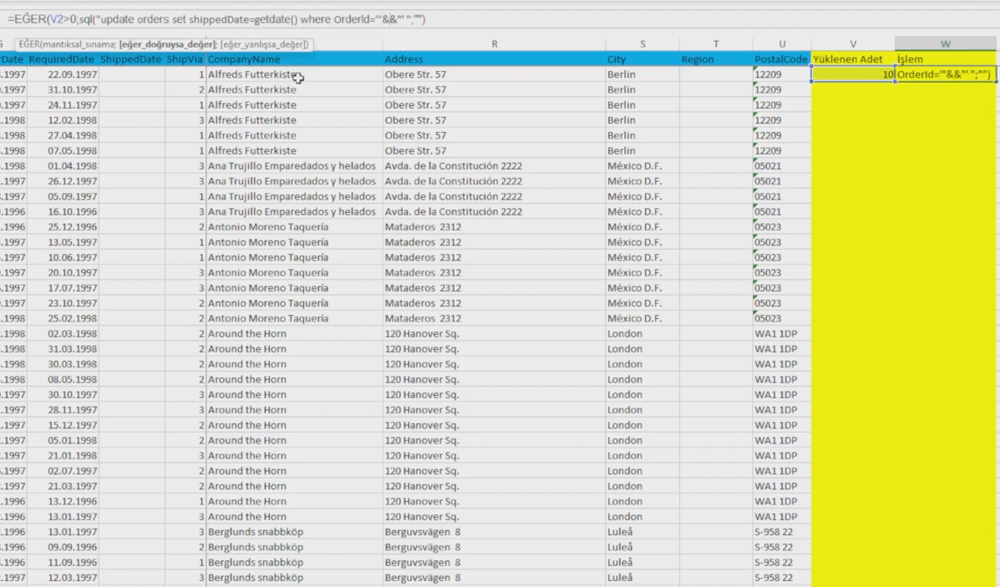
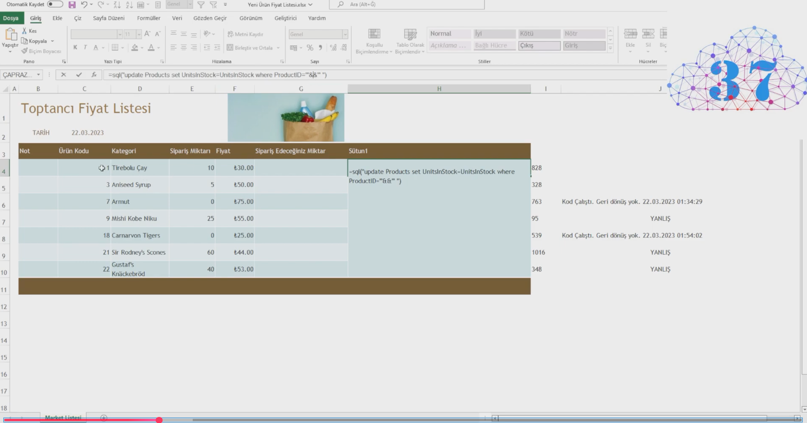

# 🔌 Excel SQL Function

Excel içerisinde SQL Server sorguları çalıştırmanızı sağlayan VBA tabanlı Excel eklentisi (XLAM).

<p align="center">
  
</p>

<p align="center">
  Excel hücrelerinden doğrudan SQL Server sorguları çalıştırın.
</p>

<p align="center">
  🎥 <a href="https://www.youtube.com/watch?v=FOMlhrxnzjQ">Kurulum Videosu</a> |
  🎥 <a href="https://www.youtube.com/watch?v=9_lxrRFeDcw">Kullanım Videosu</a>
</p>

---

# 🇬🇧 English

Excel SQL Function is an Excel Add-In (XLAM) that allows you to execute SQL Server queries directly from Excel formulas.

You can use Excel cells to:

* Run SELECT queries
* Execute UPDATE statements
* Execute INSERT statements
* Execute DELETE statements
* Retrieve values from SQL Server
* Build Excel-based data maintenance tools
* Create low-code ERP and reporting solutions

No custom application development is required.

---

# 🇹🇷 Türkçe

Excel SQL Function, Excel hücreleri içerisinden doğrudan SQL Server sorguları çalıştırmanızı sağlayan bir XLAM eklentisidir.

Excel formülleri kullanarak:

* SELECT çalıştırabilir
* UPDATE yapabilir
* INSERT yapabilir
* DELETE yapabilir
* SQL Server'dan veri okuyabilir
* Toplu veri güncellemeleri yapabilir
* Excel tabanlı veri giriş ekranları oluşturabilirsiniz

Yeni bir uygulama geliştirmeden Excel üzerinden veri yönetimi yapabilirsiniz.

---

# ✨ Özellikler

✅ Excel hücrelerinden SQL çalıştırma

✅ SQL Server bağlantısı

✅ SELECT sorguları

✅ UPDATE sorguları

✅ INSERT sorguları

✅ DELETE sorguları

✅ Sonuç döndürme (Output)

✅ Hücre referansları ile dinamik SQL üretme

✅ Toplu veri güncelleme

✅ Excel formülleri ile entegrasyon

✅ VBA tabanlı eklenti

✅ XLAM dağıtımı

---

# 📸 Ekran Görüntüleri

## Excel Eklentisi



## SQL Örnekleri



---

# 📂 Proje İçeriği

| Dosya                        | Açıklama                 |
| ---------------------------- | ------------------------ |
| sql.xlam                     | Excel eklentisi          |
| yukle.bat                    | Otomatik kurulum         |
| docs/banner.png              | Kapak görseli            |
| docs/sql.png                 | SQL örnekleri            |
| docs/2026-06-16_23-37-38.png | Uygulama ekran görüntüsü |

---

# 🚀 Kurulum

1. `yukle.bat` dosyasını Yönetici olarak çalıştırın.
2. Excel'i açın.
3. Dosya → Seçenekler → Eklentiler bölümüne gidin.
4. Excel Eklentileri → Git seçeneğine tıklayın.
5. `sql.xlam` dosyasını seçin.
6. Bağlantı bilgilerinizi yapılandırın.
7. Eklentiyi kullanmaya başlayın.

---

# 💡 Örnek Kullanım

Veri okuma:

```excel
=SQL("SELECT ProductName FROM Products WHERE ProductID=1")
```

Veri güncelleme:

```excel
=SQL("UPDATE Products SET UnitPrice=50 WHERE ProductID=1")
```

Veri ekleme:

```excel
=SQL("INSERT INTO Products(ProductName) VALUES('Yeni Ürün')")
```

Veri silme:

```excel
=SQL("DELETE FROM Products WHERE ProductID=1")
```

---

# 🎥 Video Anlatımlar

Kurulum:

https://www.youtube.com/watch?v=FOMlhrxnzjQ

Kullanım Örnekleri:

https://www.youtube.com/watch?v=9_lxrRFeDcw

---

# ⚠️ Güvenlik Uyarısı

Bu eklenti SQL komutlarını doğrudan çalıştırabilmektedir.

Üretim ortamlarında:

* Kısıtlı yetkili SQL kullanıcıları kullanın.
* UPDATE / DELETE işlemlerini test ortamında doğrulayın.
* Düzenli veritabanı yedekleri alın.

---

# 📜 Lisans

MIT License